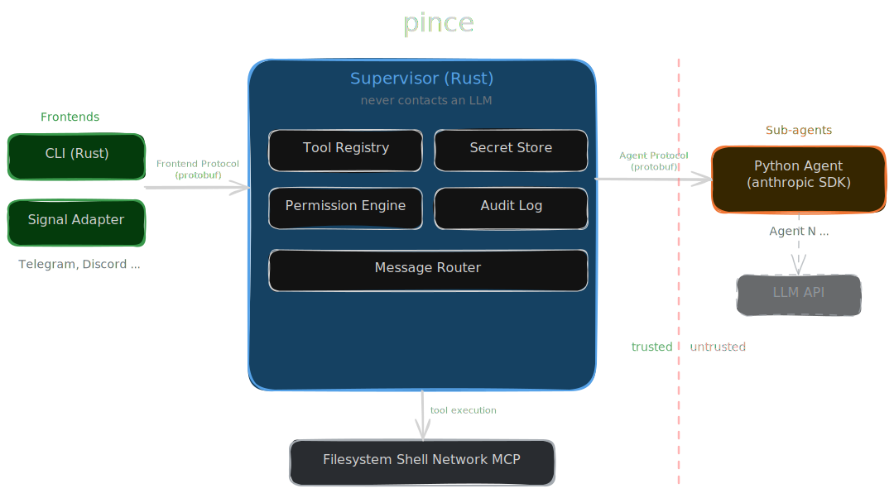

# pince

A local-first AI agent framework. One trusted supervisor process brokers all access — sub-agents handle LLM interaction but can never touch files, run commands, or see secrets directly.

## Architecture



**Key invariant:** the supervisor never contacts an LLM. Sub-agents never touch the filesystem or network directly. All capabilities flow through tool calls gated by the permission engine.

## How it works

1. User sends a message from any frontend (CLI, Signal, ...)
2. Supervisor routes it to a sub-agent over the agent protocol
3. Sub-agent calls an LLM (e.g. Claude), decides to use a tool
4. Sub-agent sends a `ToolCall` request back to the supervisor
5. Supervisor evaluates the call against the permission policy
6. If **allowed**: executes the tool, returns the result
7. If **denied**: returns a denial with reason
8. If **ask**: forwards an approval prompt to the user's frontend
9. Agent receives the result and continues its LLM loop
10. Final response streams back through the supervisor to the frontend

## Project structure

```
pince/
├── proto/                  # Protobuf definitions (source of truth)
│   └── agent.proto
├── crates/
│   ├── protocol/           # Rust protobuf codegen + framing codec
│   └── permission-engine/  # TOML policy evaluation, hot reload
├── agent/                  # Python sub-agent (anthropic SDK)
│   ├── pince_proto/        # Python protobuf codegen
│   ├── codec.py            # Framing layer
│   └── auth.py             # One-time token auth
├── scripts/
│   └── gen_proto.sh        # Regenerate Python protobuf bindings
└── denv/                   # Dev environment (Docker + trame)
```

## Security model

- **Deny-by-default** — every tool call is denied unless a policy rule explicitly allows it
- **Secrets are invisible to agents** — stored in `~/.config/pince/secrets/`, resolved by the supervisor at execution time. Agents reference secrets by name (`$secret:api-key`), never see values.
- **Policy layering** — global (`~/.config/pince/policy.toml`) + project-local (`.pince/policy.toml`). Local policies can only tighten, never loosen.
- **Audit log** — every tool call decision is logged to `~/.local/share/pince/audit.jsonl`

## Building

```bash
# Build the dev environment
docker build denv/ -t pince-denv

# Build and test
cargo build
cargo test
```

## Status

Early development. See the [trame project](https://trame.sh) for feature specs and implementation plans.
